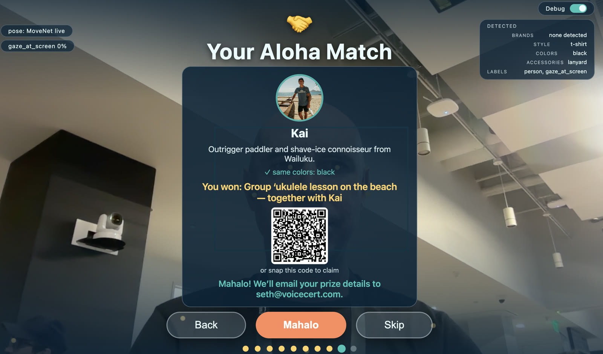

# Aloha Circle

**Don't just visit Maui. Meet Maui.** — [aloha-circle.com](https://aloha-circle.com)

Aloha Circle matches incoming visitors with Maui locals, live local causes, and donated experiences — and turns each match into a real action. The physical experience is the **Aloha Circle** at Kahului Airport (OGG). Built for the [Agent Harness Hackathon](https://www.wemakedevs.org/blogs/agent-harness-hackathon-kick-off) (TrueForge × Qodo × Bright Data).

See [PLANFILE.md](PLANFILE.md) for the full plan.

## Structure

| Dir | What |
|-----|------|
| [`/www`](www) | Vite + React website (static build → S3 behind aloha-circle.com) |
| [`/app`](app) | Expo / React Native mobile app |
| [`/agentharness`](agentharness) | The Aloha Agent: API, continuous Maui Needs Index ingest, matcher |
| [`/kioskapp`](kioskapp) | Electron kiosk for the Aloha Circle screens: the Breath of Aloha ritual |

## Quickstart

```bash
# 1. Start the agent harness (API on :8787 + ingest loop)
cd agentharness && npm install && npm start

# 2. Start the website (proxies /api to :8787)
cd www && npm install && npm run dev
# → http://localhost:5173

# 3. (optional) Mobile app in Expo Go; opt into LAN binding for device access
ALOHALIVE_HOST=0.0.0.0 npm --prefix agentharness start
cd app && npm install && npx expo start
# in the app, set API base to http://<your-LAN-IP>:8787
```

LAN binding is only for the visitor-facing API. The MCP endpoint and `/api/agent/*` control surface remain loopback-only even when `ALOHALIVE_HOST=0.0.0.0` is set.

Sign up as a visitor on the site — you'll get an instant match against the seeded locals/causes. The harness re-ingests CauseSignals continuously from `agentharness/src/sources.json`.

## Kiosk: the Breath of Aloha (`/kioskapp`)

The physical Aloha Circle runs an Electron kiosk ([VAST Builders Challenge](https://tokensand.com/vastsf) build): visitors complete the guided ritual with Kanaloa (camera-tracked gestures: honi ihu forehead hold, eyes, ears, nose, heart), then spin the **Wheel of Aloha** with a grab-and-pull gesture to win a sponsor experience, and meet the local whose style best matches theirs — claimed by email or QR. Pose runs on MoveNet/RF-DETR; a sponsor VLM (W&B Inference by CoreWeave) reads brands/style/colors for the match and backstops stalled gestures; finished sessions upload to VAST S3 and ingest into VSS search.

Live run from the hackathon floor — match stage with the admin Detected rail open (type `aloha` to toggle):



## TrueForge vertical slice

The agent harness also exposes a bounded TrueForge workflow: a persistent session reads Aloha Circle context through MCP, recomputes the deterministic match in a Daytona sandbox, and pauses for human approval before it can persist one idempotent demo introduction-request record. The approval creates a short-lived, one-use capability for the exact pending tool arguments, so a direct MCP call cannot bypass the checkpoint. It does not send a message, make a donation, deploy anything, or perform a real-world introduction.

The default test suite is hermetic and needs no provider credentials:

```bash
nvm use 22
npm --prefix agentharness ci
npm --prefix agentharness test
```

The live evidence test is intentionally opt-in because it requires a locally configured TrueForge instance, model, Daytona sandbox provider, and MCP connector. See [`agentharness/TRUEFORGE.md`](agentharness/TRUEFORGE.md) for the exact setup, denial/approval checks, and reconnect proof.

## Branches & Deploys

Day-to-day work happens on **`dev`** (the default branch); **`production`** is the live release branch. GitHub Actions deploys on push, assuming the `alohalive-github-deploy` IAM role via OIDC (repo variable `AWS_DEPLOY_ROLE_ARN`):

| Branch | Workflow | Deploys to |
|--------|----------|-----------|
| `dev` | [deploy-dev.yml](.github/workflows/deploy-dev.yml) | https://dev.aloha-circle.com |
| `production` | [deploy-prod.yml](.github/workflows/deploy-prod.yml) | https://aloha-circle.com (www + legacy alohalive.net 301 to it) |

Each deploy re-applies [`infra/site.yaml`](infra/site.yaml) (S3 + CloudFront + ACM + Route53 per environment) then builds `www` and syncs it to the environment's bucket with a CloudFront invalidation (`infra/deploy.sh` + `infra/deploy-web.sh`). The one-time OIDC role lives in [`infra/cicd.yaml`](infra/cicd.yaml) (stack `alohalive-cicd`). CI discovers the deployed API Gateway endpoint from the `alohalive-donations` stack so the site and deployment smoke test use the same backend.

Release flow: PR feature → `dev` (auto-deploys dev site) → PR `dev` → `production` (auto-deploys live site).

## Qodo Code Review Evidence

| PR | Qodo findings | Resolution |
|----|---------------|------------|
| [#18](https://github.com/ContingentX/aloha-circle/pull/18) | 6 bugs, 3 rule violations (review arrived after merge) | Findings are addressed in the focused public-API hardening follow-up. |
| [#23](https://github.com/ContingentX/aloha-circle/pull/23) | 2 bugs across incremental reviews, 1 rule violation | Require authenticated, single-write daily-limited nonprofit submissions; record this PR's review evidence. |
| [#29 scroll-world hero](https://github.com/ContingentX/aloha-circle/pull/29) | 4 findings: hero never releases at end-of-track so the app stays buried (High), engine has no teardown so StrictMode double-mounts it, phones fall back to 1080p desktop clips, missing evidence row in this table | All four addressed in [#30](https://github.com/ContingentX/aloha-circle/pull/30): end-of-track handoff with `.sw-done` release, full unmount from `mountScrollWorld`, posters-only on phones without mobile encodes, and these rows |
| [#30 handoff fix](https://github.com/ContingentX/aloha-circle/pull/30) | 3 findings: evidence row missing (reviewed before the row commit landed), clip fetches survive engine teardown so StrictMode replay downloads 1080p media twice, scroll-queued `read()` RAF outlives unmount and can touch detached nodes | All addressed in-PR: rows added; clip fetches now use AbortControllers aborted on unmount; the queued read RAF is tracked + cancelled and `read()` guards on disposal |
| [#33 aloha-circle.com domain](https://github.com/ContingentX/aloha-circle/pull/33) | 3 findings: evidence row missing, donations stack template lived at `infra/donations.yaml` instead of under `infra/donations/`, and `WithAlt` fires on `AltDomainName` alone so an empty `AltHostedZoneId` fails mid-deploy in ACM/Route53 instead of up front | All addressed in-PR: this row; template moved to `infra/donations/donations.yaml` (deploy.sh updated); CloudFormation `Rules` now assert the alt domain/zone pair is provided together, rejecting half-specified invocations at changeset time |
| [#36 Aloha Circle rebrand](https://github.com/ContingentX/aloha-circle/pull/36) | 5 findings: logo/favicons served from the site root instead of `/media/` (rule), evidence row missing, final-scene handoff translation ignores `prefers-reduced-motion`, app bridge header still said AlohaLive, and Stripe checkout + SES verification emails still branded AlohaLive | 4 addressed in-PR: this row; reduced-motion users get a cross-dissolve instead of the full-viewport translation; bridge header rebranded; Stripe product name + SES sender/subject/body rebranded (verified `verify@alohalive.net` SES identity retained). The `/media/` move was declined with evidence: `deploy-web.sh` syncs `dist/` with `--exclude "media/*"`, so build-shipped assets under `/media/` would never reach the bucket — the rule targets large S3-only media, now clarified in CLAUDE.md |
| [#44 kioskapp Electron MVP](https://github.com/ContingentX/aloha-circle/pull/44) | Qodo did not review — billing-blocked (trial ended), noted by the bot on the PR. Substitute review by Claude-Fable (merge owner) on the PR: 11/11 tests pass, live `KIOSK_SHOT` boot smoke with MoveNet live, public-repo secret scan clean, Electron contextIsolation + narrow preload verified | Merged to `dev` with three tracked non-blocking notes: honi hold timer doesn't cancel if the visitor pulls away, Cosmos stall judge arms once per stage, TF.js CDN scripts should be vendored for offline kiosk mode (queued for cloud agents) |
| [#49 kiosk session recorder](https://github.com/ContingentX/aloha-circle/pull/49) | Qodo still billing-blocked. Substitute review by Claude-Fable (merge owner) on the PR: 14/14 tests pass (incl. pinned SigV4 reference vector), live boot smoke green, VAST/VSS config is env-only (no secrets in the public repo), session lifecycle verified (begin on leaving attract, save only on reaching Mahalo, discard on abandon) | Merged to `dev`; live upload to the team-18 VAST bucket activates via `VAST_S3_*`/`VSS_*` env vars once lab credentials arrive — local recordings are kept regardless |
| [#59 gesture advance fix](https://github.com/ContingentX/aloha-circle/pull/59) | Qodo still billing-blocked. Substitute review by Claude-Fable-Laptop (merge owner): 75/75 tests pass incl. 6 new occlusion/decay cases; every existing fixture sequence re-verified by hand against the new thresholds | Merged to `dev`: gesture predicates now tolerate the occlusion their own gestures cause (face-anchor fallback, visible-wrist heart check, wrist score floor 0.2) and dwell decays per missed frame instead of resetting, so ritual stages advance without the button |
| [#60 VSS sync schema + AWS relay](https://github.com/ContingentX/aloha-circle/pull/60) | Qodo still billing-blocked. Substitute review by Claude-Fable-Laptop (merge owner): 77/77 tests pass; /start schema verified live against team-18-vss.thecosmoslabs.com (prefill fields 422 on /start — discovered by probing, fixed to `source_*` fields) | Merged to `dev`: triggerVssSync posts the real batch-sync/start schema with optional read-only `VSS_SOURCE_*` creds, uploads get the right Content-Type, and sessions transcode webm→mp4 (best-effort ffmpeg) before upload since the VSS pipeline is mp4-proven. Backfill of Seth's 20:48Z ritual ingested via this path: 7 chunks, job team-18_1790976563 |
| [#61 palm extrapolation + stall-judge retry](https://github.com/ContingentX/aloha-circle/pull/61) | Qodo still billing-blocked. Substitute review by Claude-Fable (merge owner): 82/82 tests pass; the 3 new palm fixtures mutation-checked (fail against the pre-fix predicates); fixture arithmetic hand-verified | Merged to `dev`: COCO-17 has no hand keypoints, so predicates extrapolate a palm point along elbow→wrist and accept wrist OR palm; the VLM stall judge retries every 5s (generation-guarded) instead of firing once |
| [#62 admin-gated debug overlay](https://github.com/ContingentX/aloha-circle/pull/62) | Qodo still billing-blocked. Substitute review by Claude-Fable-Laptop (author + kiosk owner): 93/93 tests (11 new for the key-sequence matcher); full reveal/hide/re-arm cycle verified in a real DOM via headless Chrome with computed-style assertions | Merged to `dev`: pose-debug visuals (face box, dots, label, backend pill) hidden for visitors; typing "aloha" reveals a top-right Debug switch, switching off re-hides and re-arms — detection keeps running, only rendering is CSS-gated |
| [#63 debug-readout stacking](https://github.com/ContingentX/aloha-circle/pull/63) | Qodo still billing-blocked. Substitute review by Claude-Fable-Laptop (author): 2-line CSS move; separation verified in a real DOM via headless Chrome computed rects (pill at 12,60 below the 12,12–432,52 canvas label) | Merged to `dev`: the pose backend pill now stacks under the canvas gesture label instead of overlapping it in admin mode |
| [#64 live brand-sense + admin Detected rail](https://github.com/ContingentX/aloha-circle/pull/64) | Qodo still billing-blocked. Substitute review by Claude-Fable (merge owner; module co-author): 134/134 tests pass on the stacked branch including the 11 brandSense/brandPanel suites; VLM output rendered via textContent only (injection-safe); report + labels stamping verified against recorder.finish() ordering | Merged to `dev`: one keyframe per session goes to the same CoreWeave/gemma endpoint as the stall judge and returns strict-JSON brands/style/colors/accessories; painted in a Detected rail under the admin Debug switch beside live pose labels, and stamped onto the session sidecar as `meta.brandReport` + `meta.labels` |
| [#65 match wheel finale](https://github.com/ContingentX/aloha-circle/pull/65) | Qodo still billing-blocked. Substitute review by Claude-Fable (author): 134/134 tests at f2c99c0 (new fixture suites: matcher gender gate/weights/tie-break determinism; wheel physics incl. float-boundary epsilon; grab/pull state machine incl. flicker grace + pull-window expiry); wheel + match stages verified in real Electron renders via KIOSK_SHOT (live bucket portrait, QR, buttons clear); claim email kept out of uploads by design | Merged to `dev`: post-Heart Wheel of Aloha (grab-top/pull-down wrist gesture or Spin button, constant-deceleration landing on 8 sponsor experiences), then a strict-gender deterministic brand/style match against six Masky-generated demo locals, claimed by email or QR; `meta.wheel`/`meta.match` ride the sidecar, `meta.claim` stays local |
| [#66 README kiosk example](https://github.com/ContingentX/aloha-circle/pull/66) | Qodo still billing-blocked. Substitute review by Claude-Fable (author): docs-only; image compressed 3.2MB PNG → 158KB JPEG, raw URL verified 200 on dev; Seth's visible email flagged to him in channel before merge | Merged to `dev`: Kiosk section with the live match-stage screenshot from the hackathon floor + the missing /kioskapp Structure row |
| [#68 helicopter tour experience](https://github.com/ContingentX/aloha-circle/pull/68) | Qodo still billing-blocked. Substitute review by Claude-Fable (author): one-line data addition; wheel geometry/physics/tests are segment-count-agnostic, 134/134 pass | Merged to `dev`: Maui helicopter tour as the ninth Wheel of Aloha experience (anchors the explainer-video story) |
| [#69 /about explainer page](https://github.com/ContingentX/aloha-circle/pull/69) | Qodo still billing-blocked. Substitute review by Claude-Fable (author): pathname gate mirrors the existing app-bridge pattern, no router added; `www` builds clean; page verified via local `vite preview` screenshot; video ships bucket-side per the /media policy (not in git) | Merged to `dev`: /about page embedding the 3-minute explainer film (media/explainer.mp4 + poster uploaded to both site buckets) |
| [#70 kiosk fake camera](https://github.com/ContingentX/aloha-circle/pull/70) | Qodo still billing-blocked. Substitute review by Claude-Fable (author): both new paths are env-gated dev tooling (`KIOSK_FAKE_CAM`, `KIOSK_REC` alwaysOnTop) with zero reach into kiosk-mode behavior; pose + brand polling verified live against the substituted feed during the explainer takes | Merged to `dev`: deterministic camera feed for recorded takes; Chromium fake-device switches documented as inert in this Electron build |
| [#67 wheel pivot + numbers + pull fix](https://github.com/ContingentX/aloha-circle/pull/67) | Qodo still billing-blocked. Substitute review by Claude-Fable-Laptop (author + merge owner) on the PR: 139/139 tests pass; the 5 new gesture/markup cases are mutation-checked (fail 5/16 against the old wheel.js); center pivot verified in a real Chrome render (0.00px bbox-center drift at rotate(137deg)) | Merged to `dev`: the rotor carries `transform-box:view-box` + `transform-origin:50% 50%` so the wheel spins about its own center instead of the viewBox corner; wedges show big numbers 1–8 with the matched experience revealed by number after landing; the pull-down now fires reliably — the pull clock re-baselines while the hand hovers (reaction time no longer eats the window), travel dropped to 0.8 shoulder-widths with an explicit min pull speed, and the same-side elbow stands in when MoveNet loses the wrist mid-pull |
| [#19 prod deploy](https://github.com/ContingentX/aloha-circle/pull/19) | 19 findings (12 bugs, 7 rule violations): spin race + lost retry path, raceable code-attempt cap, unpaginated scans, `VITE_API` vs `VITE_API_BASE` mismatch, hard-coded dev bridge in the app, non-OGG boarding passes verifying travelers, seed script dropping throttled writes, upload-before-pending trap, silent profile errors, missing CauseSignal fields, matcher tie-break, and more | Triaged in follow-up PR to `dev` (`fix/qodo-pr19-feedback`): 13 fixed; Stripe Connect payouts, per-env backend stacks, endorsement auth, and unforgeable traveler evidence deferred as product/infra decisions; static nonprofit rail and template location rejected as intentional |
